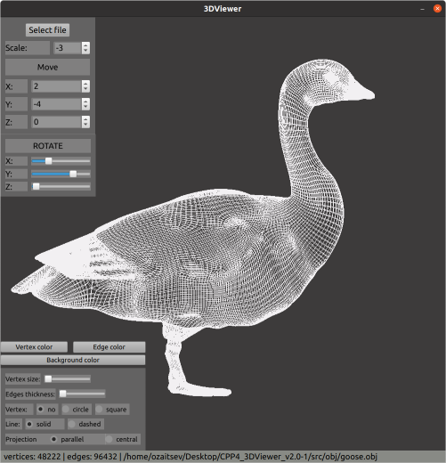

# 3D Model Viewer

Desktop application for observing 3D .obj models

## Contents

1. [General Info](#general-info) \
   1.1. [Internal Details](#internal-details)
2. [Installation](#installation)
3. [Testing](#testing)
4. [Other Features](#other-features)


## General Info

This desktop application allows you to examine 3D wireframe models loaded from .obj files.



User has the ability to move, rotate and translate models


Also, this application allows you to change projection type, colors and other preferences of the view


### Internal Details

Generally, this application is developed in C++ language of C++17 standard with GUI based on Qt (Qt6). This project is developed strictly according to the OOP approach. The application's architecture is designed to fully utilize the benefits of an object-oriented approach. It incorporates design patterns such as Builder, Strategy, and Facade, while following the MVC (Model-View-Controller) pattern

List of technologies used in this project:

- *Language:* **C++17**
- *GUI:*      **Qt6**
- *Graphics:* **OpenGL** 
- *Testing:*  **GoogleTest**
- *Building:*  **Makefile and QMake**


## Installation

To install the application you need:

- g++ compiler
- Make
- Qt framework (Qt6 is preferable)
- Qmake

#### 1. Navigate to src directory
```
cd src
```
#### 2. Install Qt application
```
make install
```
#### 3. Run the application
On Linux:
```
make run
```
On MacOS (from src):
```
./3dviewer/build/3dviewer_v2.app/Contents/MacOS/3dviewer_v2
```

## Testing

To run the application tests you need:

- g++ compiler
- Make
- GoogleTest framework (GTest)

Additionaly, to compile coverage report you need:

- gcov
- lcov (to generate HTML)

#### Run the tests
From src directory
```
make test
```
#### Compile coverage report
```
make gcov_report
```
Coverage report compiles at `report` folder

## Other Features

#### Getting Documentation
For generating documentation, you need Doxygen
```
make dvi
```
#### Distribution
```
make dist
```
#### Cleaning
Cleans unnecesary files generated after installation. Also cleans all coverage report files
```
make clean
```
#### Uninstall application
Removes all installed files
```
make uninstall
```
